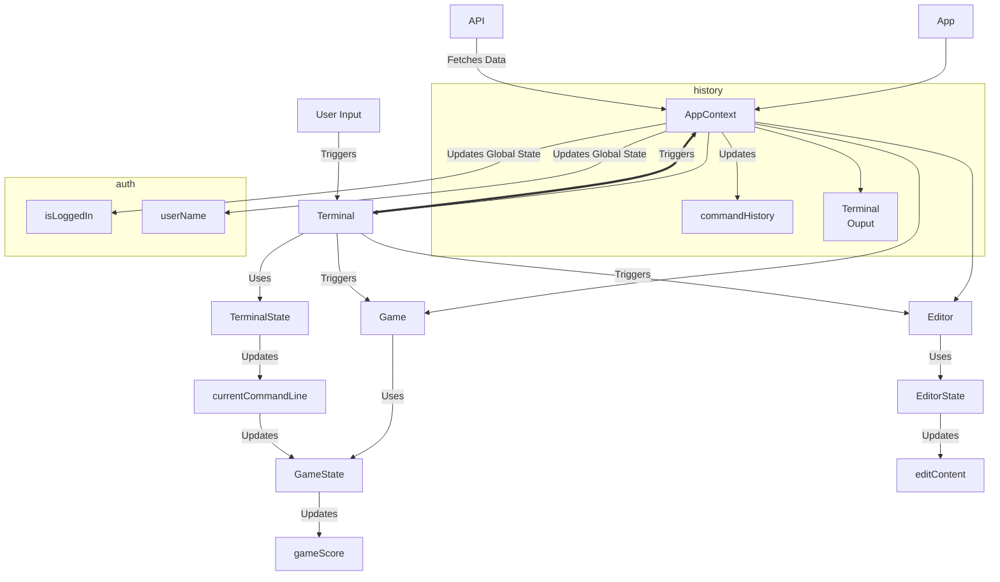

# Arrange Component and State Hierarchy

## Component State Interactions

1. Component-Specific State: 
   - Editor state (like editContent, editFilePath, etc.) should indeed be managed within the MonacoEditor.tsx and related files.
   - Game state should be managed within the Game component.
     - The game needs access to the terminal state, which controls the game.
   - Terminal-specific state should stay within the Terminal component.

2. Shared/Global State:
   - Keep only truly global states in AppContext, such as:
     - currentActivity
     - isLoggedIn
     - userName
   - These are states that genuinely affect multiple components or the overall app behavior.

3. Preventing Vestigial Values:
   - Code Review: Regularly review your interfaces and components to remove unused props or state.
   - Static Analysis: Use TypeScript's strict mode and tools like ESLint to catch unused variables.
   - Unit Tests: Write tests that check for the presence and necessity of each prop and state.

4. Architectural Documentation:
   - Component Tree: Create a visual representation of your component hierarchy.
   - State Management Diagram: Show which states are managed where (global, component-level, etc.).
   - Data Flow Diagram: Illustrate how data and actions flow between components.

5. Code Organization:
   - Use a feature-based folder structure to keep related components, hooks, and contexts together.
   - Implement custom hooks for shared logic between components.

6. Regular Refactoring:
   - Schedule regular refactoring sessions to clean up and optimize your code structure.

Here's a simple example of how you might document your component and state structure:

```
App
├── AppContext (global state)
│   ├── currentActivity
│   ├── Command output history
│   ├── isLoggedIn
│   └── userName
├── Terminal
│   ├── State: commandHistory, currentCommand
│   └── Context: TerminalContext (if needed)
├── Editor
│   ├── State: editContent, editFilePath, isEditMode
│   └── Context: EditorContext (if needed)
├── Game
│   ├── State: gameState, score, currentCommand, animation level, challenge phrase
│   └── Context: GameContext (if needed)
└── Authentication
    ├── State: authStatus
    └── Context: AuthContext
```

