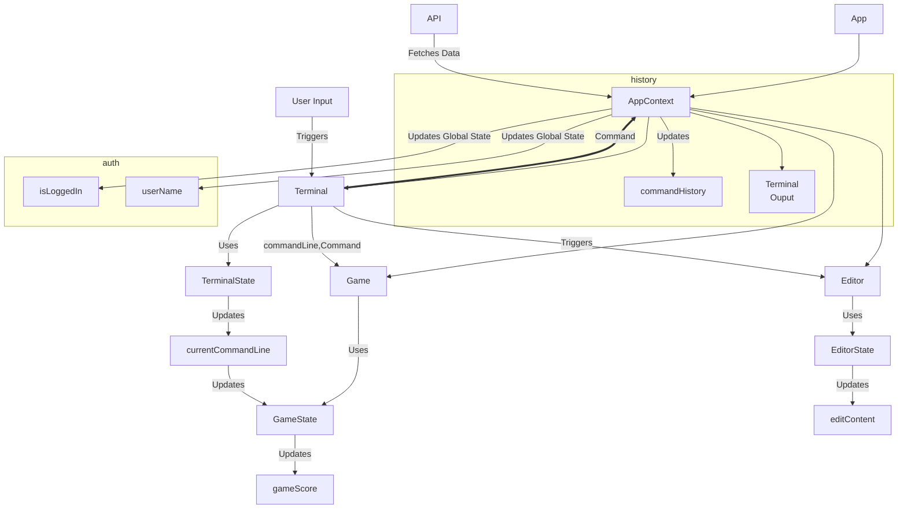

# Arrange Component and State Hierarchy

## Component State Interactions

1. Component-Specific State: 
   - Editor state (like editContent, editFilePath, etc.) should indeed be managed within the MonacoEditor.tsx and related files.
   - Game state should be managed within the Game component.
     - The game needs access to the terminal state, which controls the game.
   - Terminal-specific state should stay within the Terminal component.

2. Shared/Global State:
   - Keep only truly global states in AppContext, such as:
     - currentActivity
     - Command output history
     - isLoggedIn
     - userName
   - These are states that genuinely affect multiple components or the overall app behavior.

3. Command Handling:
   - Use CommandContext to manage command-related state and functions:
     - executeCommand
     - commandHistory
     - WPM calculation

4. Terminal Management:
   - Use useTerminal hook for xterm-specific functionality:
     - xtermRef
     - commandLine
     - writeToTerminal
     - resetPrompt

5. Activity Mediation:
   - Use ActivityMediatorContext for managing transitions between different activities (normal, game, tutorial, edit).

Here's a simple example of how you might document your component and state structure:

```
App
├── AppContext (global state)
│   ├── currentActivity
│   ├── Command output history
│   ├── isLoggedIn
│   └── userName
├── Terminal
│   ├── State: commandHistory, currentCommand
│   └── Context: TerminalContext (if needed)
├── Editor
│   ├── State: editContent, editFilePath, isEditMode
│   └── Context: EditorContext (if needed)
├── Game
│   ├── State: gameState, score, currentCommand, animation level, challenge phrase
│   └── Context: GameContext (if needed)
└── Authentication
    ├── State: authStatus
    └── Context: AuthContext
```

