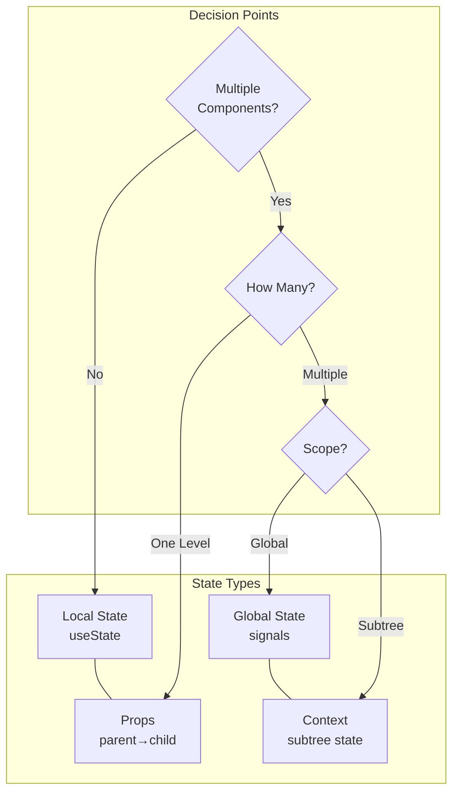
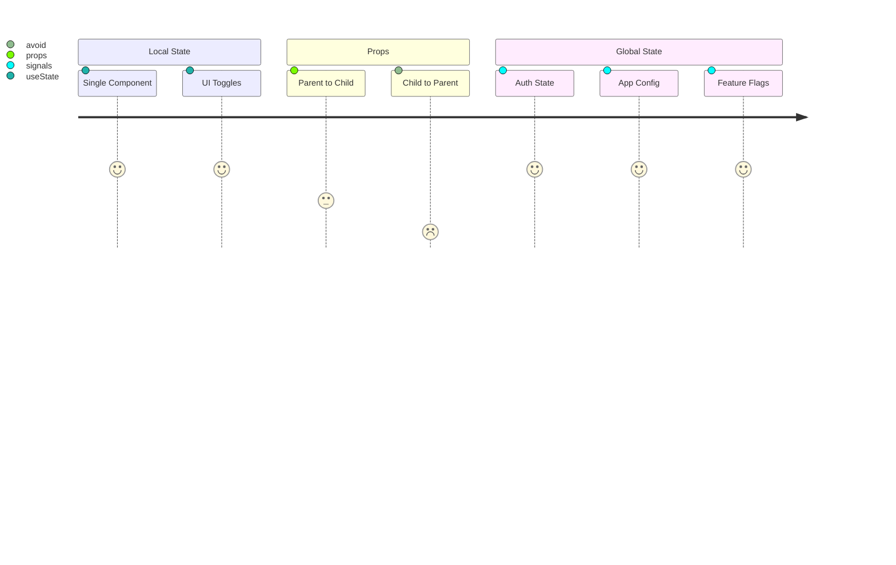

# Arrange Component and State Hierarchy

## State Location Decision Tree

1. Local Component State (useState)
   - Use when: State is only used within one component
   - Example: Form input temporary values, UI toggle states
   - ✅ RECOMMENDED for single-component state

2. Parent-to-Child Props
   - Use when: State needs to be shared with exactly one child
   - Example: Passing configuration options down one level
   - ✅ ACCEPTABLE for single-level sharing
   - ⚠️ Consider alternatives if child needs to update parent

3. Multi-Component State Sharing
   - When state needs to be accessed/modified by multiple components:
   - ❌ AVOID prop drilling (passing through multiple components)
   - ✅ USE instead:
     a. Signals (for global reactive state)
     b. Context (for subtree state with many consumers)
     c. State management library (for complex state logic)

## State Management Selection Criteria

| Scenario                          | Recommended Approach | Rationale                     |
| --------------------------------- | -------------------- | ----------------------------- |
| UI-only state in single component | Local useState       | Simplest, most encapsulated   |
| Shared between parent/child       | Props                | Direct relationship           |
| Used across component tree        | Signals/Context      | Avoid prop drilling           |
| Global app state                  | Signals              | Reactive, easy to debug       |
| Complex state logic               | State library        | Better state management tools |
```

For diagramming, I'd suggest a combination of:

1. Component/State Flow Diagram:


2. C4 Container Diagram for Component Relationships:
```mermaid
C4Container
    Container(app, "App", "React", "Application container")
    Container(term, "Terminal", "Component", "Terminal interface")
    Container(login, "Login", "Component", "Login handling")
    Container(signals, "AppSignals", "State", "Global reactive state")
    
    Rel(term, "reads/writes", signals, "login state")
    Rel(login, "updates", signals, "auth state")
    UpdateRelStyle(term, signals, "red", "dashed")
```

3. State Flow Matrix:


**Signals vs Context**
- **Signals** (like @preact/signals-react):
  - Best for: Global state that needs reactive updates
  - Advantages:
    - Simple API (get/set values)
    - No provider wrapping needed
    - Automatic re-rendering optimization
    - Easy to debug (values are inspectable)
  - Use when:
    - State needs to be accessed anywhere in the app
    - You want immediate reactive updates
    - State is relatively simple (key-value pairs)
    - Example: User auth state, theme settings, feature flags

- **Context**:
  - Best for: Subtree-specific state that multiple components need
  - Advantages:
    - Scoped to specific component tree
    - Can provide complex objects/functions
    - Built into React
    - Explicit provider boundary
  - Use when:
    - State is specific to a feature/section
    - You need to provide multiple related values/functions together
    - You want to avoid global namespace pollution
    - Example: Form context, localization context for a section

**State Libraries**:
- **XState**: 
  - For complex state machines and workflows
  - When you need visual state charts
  - Complex business logic with many states/transitions

- **Redux**:
  - Large applications with complex state interactions
  - When you need strong dev tools and time-travel debugging
  - Centralized state management with strict patterns

- **MobX**:
  - Complex observable state trees
  - When you need fine-grained reactivity
  - Object-oriented state management

- **Zustand**:
  - Simpler alternative to Redux
  - When you need middleware but want less boilerplate
  - Modern alternative to complex state libraries
