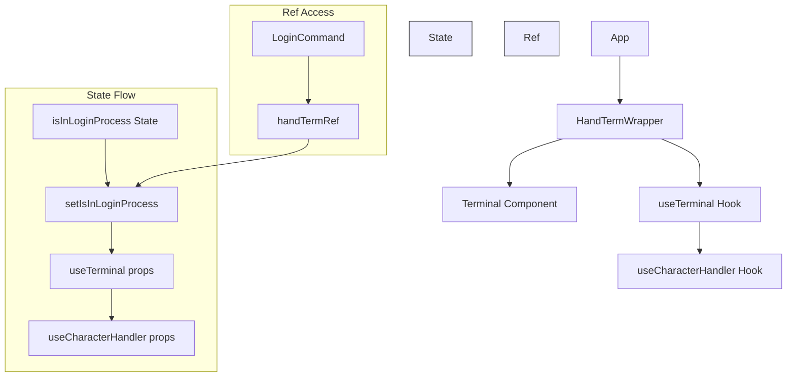
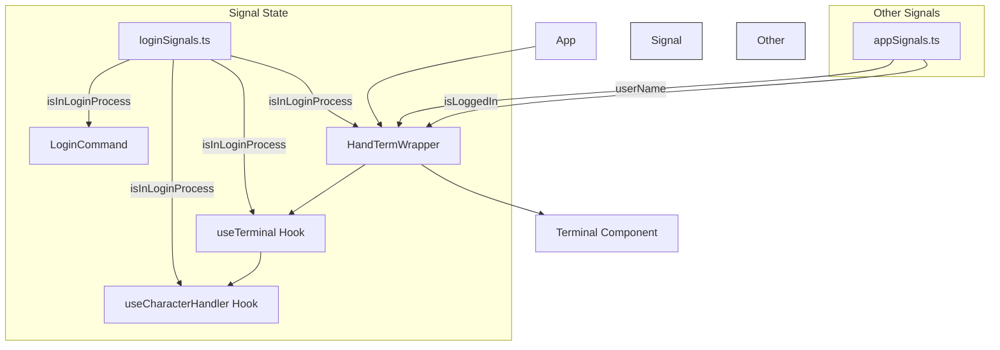

Current Situation (Props/State/Refs):

```mermaid
graph TD
    A[App] --> B[HandTermWrapper]
    B --> C[Terminal Component]
    B --> D[useTerminal Hook]
    D --> E[useCharacterHandler Hook]
    
    subgraph State Flow
        B1[isInLoginProcess State] --> B2[setIsInLoginProcess]
        B2 --> D1[useTerminal props]
        D1 --> E1[useCharacterHandler props]
    end
    
    subgraph Ref Access
        L[LoginCommand] --> R[handTermRef]
        R --> B2
    end
    
    style State Flow fill:#f9f,stroke:#333
    style Ref Access fill:#bbf,stroke:#333
```

Proposed Solution (Using Signals):

```mermaid
graph TD
    A[App] --> B[HandTermWrapper]
    B --> C[Terminal Component]
    B --> D[useTerminal Hook]
    D --> E[useCharacterHandler Hook]
    
    subgraph Signal State
        S1[loginSignals.ts]
        S1 --> |isInLoginProcess| B
        S1 --> |isInLoginProcess| D
        S1 --> |isInLoginProcess| E
        S1 --> |isInLoginProcess| L[LoginCommand]
    end
    
    subgraph Other Signals
        S2[appSignals.ts] --> |isLoggedIn| B
        S2 --> |userName| B
    end
    
    style Signal State fill:#9f9,stroke:#333
    style Other Signals fill:#ff9,stroke:#333
```