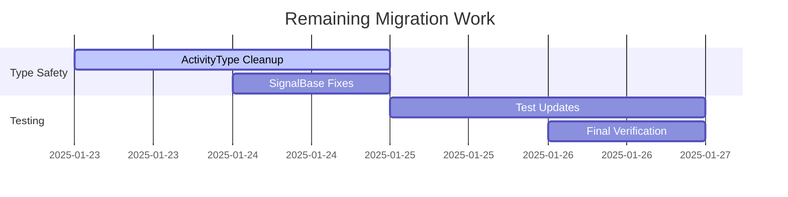

# Migration from @monaco-editor/react to Direct Monaco Implementation

## Rationale
- Remove wrapper dependency complexity
- Simplify type definitions
- Gain direct control over editor lifecycle
- Match existing type validation patterns ([monaco-type-consolidation.md](../reconcile-mock-types-with-prod/monaco-type-consolidation.md))

## Implementation Strategy

## Current Status (2025-01-23)

### Completed
- [x] Dependency removal implemented
- [x] Core type declarations updated
- [x] Direct Monaco initialization

### Pending
- [ ] 62 ActivityType references across 31 files
- [ ] SignalBase implementation fixes
- [ ] Touch event handler safety
- [ ] Test file updates

### Next Actions
1. Batch remove ActivityType imports
2. Implement SignalBase abstract methods
3. Add null coalescing to touch handlers
4. Update e2e test imports



### Phase 1: Base Editor Setup
- [x] Remove @monaco-editor/react from package.json
- [ ] Create container component pattern:
```tsx
// Example container setup
const EditorContainer = () => {
  const containerRef = useRef<HTMLDivElement>(null);

  useEffect(() => {
    if (containerRef.current) {
      const editor = monaco.editor.create(containerRef.current, {
        value: '',
        language: 'typescript'
      });

      return () => editor.dispose();
    }
  }, []);

  return <div ref={containerRef} style={{ height: '100vh' }} />;
}
```

### Phase 2: Feature Parity Implementation
- [ ] Port tree view navigation logic
- [ ] Reimplement VIM mode integration
- [ ] Migrate keyboard shortcut handling
- [ ] Port file content synchronization

### Phase 3: Type Safety & Validation
- [ ] Implement runtime validation pattern:
```typescript
interface MonacoWindow extends Window {
  monaco: typeof import('monaco-editor');
}

const getValidEditor = (editor: unknown) => {
  if (editor && typeof editor === 'object' && 'getValue' in editor) {
    return editor as monaco.editor.IStandaloneCodeEditor;
  }
  throw new Error('Invalid editor instance');
};
```

### Phase 4: Migration Path
- [ ] Create parallel implementation (DirectMonacoEditor.tsx)
- [ ] Update test files incrementally
- [ ] Final switchover checklist:
  - [ ] Verify all e2e tests pass
  - [ ] Confirm type safety in CI
  - [ ] Update documentation
  - [ ] Remove old component

## Code Examples

### Basic Editor Initialization
```tsx
import * as monaco from 'monaco-editor';

export const createEditor = (container: HTMLElement) => {
  return monaco.editor.create(container, {
    value: '// Start coding...',
    language: 'typescript',
    minimap: { enabled: false },
    automaticLayout: true
  });
};
```

### React Component Structure
```tsx
import { useRef, useEffect } from 'react';

const MonacoEditor = ({ value }: { value: string }) => {
  const containerRef = useRef<HTMLDivElement>(null);
  const editorRef = useRef<monaco.editor.IStandaloneCodeEditor>();

  useEffect(() => {
    if (containerRef.current) {
      editorRef.current = monaco.editor.create(containerRef.current, {
        value,
        language: 'typescript'
      });
    }

    return () => editorRef.current?.dispose();
  }, []);

  return <div ref={containerRef} style={{ height: '80vh' }} />;
};
```

## Risk Mitigation
1. Maintain both implementations during transition
2. Use feature flags for gradual rollout
3. Add additional runtime validation
4. Increase test coverage for editor interactions

## Estimated Timeline
| Phase | Duration |
|-------|----------|
| Setup | 2 days |
| Feature Porting | 3 days |
| Validation | 1 day |
| Migration | 1 day |