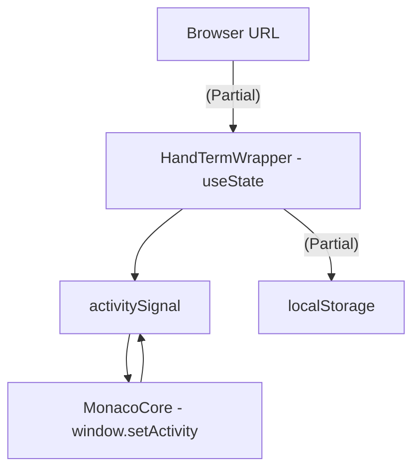
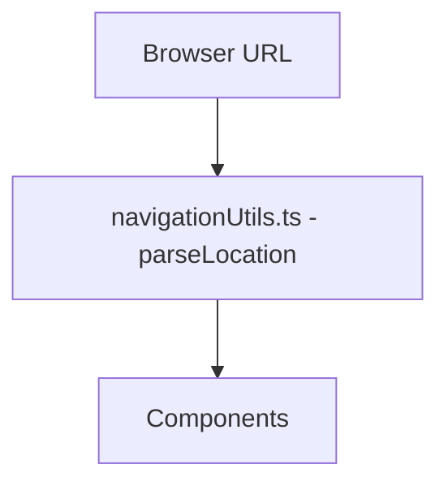

# Plan to Remove Signals and localStorage for Activity State

## Goal

Refactor the codebase to use the URL search query parameters (specifically the `activity` parameter) as the single source of truth for `ActivityType`, removing dependencies on Signals and `localStorage` for this specific purpose. This aligns with the approach implemented in `src/utils/navigationUtils.ts`.

## Problem

Currently, the application uses a mix of Signals (`activitySignal`, `activityState`), `localStorage`, and potentially direct state updates (`setCurrentActivity`) to manage the `ActivityType`. This creates inconsistencies and makes it difficult to track the source of truth for the application's current activity. The goal is to centralize this logic around the URL, making it the definitive source for `ActivityType`.

## Approach

1.  **Centralize Activity Retrieval:**
    *   Ensure that `src/utils/navigationUtils.ts`'s `parseLocation()` and `parseActivityType()` functions are the primary methods for determining the current `ActivityType`.
    *   Modify any components that directly set or read `ActivityType` from Signals or `localStorage` to instead use these functions.

2.  **Refactor `HandTermWrapper.tsx`:**
    *   Remove the `useState` hook for `currentActivity` and `setCurrentActivity`.
    *   Instead of using `activitySignal`, derive `ActivityType` directly from the URL using `parseLocation().activityKey` within a `useMemo` or similar hook to avoid unnecessary re-renders.
    *   Remove the `useEffect` hook that subscribes to `activitySignal`.
    *   Remove the `window.setActivity` function and its usages.  Update any calls to `window.setActivity` to instead use the `navigateTo` function from `src/utils/navigationUtils.ts`.
    *   Remove the logic related to storing and retrieving `ActivityType` in `localStorage`.

3.  **Refactor `MonacoCore.tsx`:**
    *   Remove the calls to `window.setActivity` within the Vim command definitions (`:q`, `:wq`).
    *   Replace these calls with calls to `navigateTo` from `src/utils/navigationUtils.ts`, passing the appropriate `ActivityType` (likely `ActivityType.NORMAL` in these cases).

4.  **Refactor `src/utils/activityState.ts`:**
    *   Remove the `activityState` signal.
    *   Remove the `completeTransition` function, as transitions will be handled by `navigationUtils.ts`.
    *   Remove or update the state helper functions (`isInActivity`, `getCurrentActivity`, `getPreviousActivity`) to either derive their values from the URL or be removed if no longer necessary.
    *   Remove `checkTutorialCompletion` if it is only used for activity state.

5.  **Update Tests:**
    *   Review and update the end-to-end tests in `src/e2e/` that interact with `localStorage` or Signals related to `ActivityType`.
    *   Specifically, update tests that mock `window.setActivity` or directly manipulate `activitySignal`.
    *   Ensure tests use the `navigateTo` function or directly manipulate the URL to change the `ActivityType` and verify the expected behavior.
    *   Tests to focus on include:
        *   `src/e2e/tests/activity-state.spec.ts`
        *   `src/e2e/tests/signal-initialization.spec.ts`
        *   `src/e2e/tests/edit-content-display.spec.ts`
        *   `src/e2e/tests/edit-content-vim.spec.ts`
        *   `src/e2e/edit-command.spec.ts`
        *   `src/e2e/page-objects/TerminalPage.ts` and its spec file
        *   `src/e2e/monaco-tree-view.spec.ts`
        *   `src/components/HandTermWrapper.test.tsx`

6.  **Other Usages:**
    *   Any other components or files identified during the initial `search_files` that use `activitySignal` or `localStorage` for activity state should be refactored similarly.

## Mermaid Diagram

### Current State (Simplified)

### Proposed State

## Potential Challenges

*   Ensuring that all instances of `activitySignal` and `localStorage` usage related to `ActivityType` are correctly identified and refactored.
*   Handling any edge cases or unexpected behavior that may arise from changing the core state management logic.
*   Updating tests to accurately reflect the new URL-based state management.

## Steps

1.  Refactor `HandTermWrapper.tsx` as described above.
2.  Refactor `MonacoCore.tsx` as described above.
3.  Refactor `src/utils/activityState.ts` as described above.
4.  Update the tests listed above.
5.  Run tests and address any failures.
6.  Perform a comprehensive manual test of the application, focusing on activity switching and transitions.
7.  Address any remaining usages of `activitySignal` or `localStorage` for activity state found during testing.
